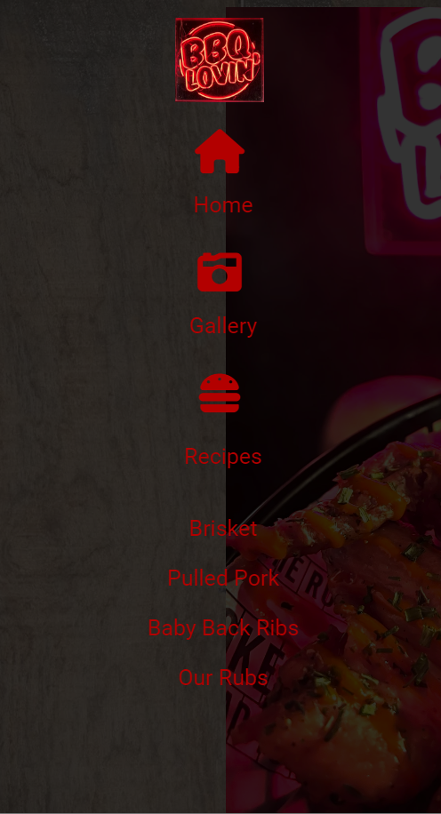
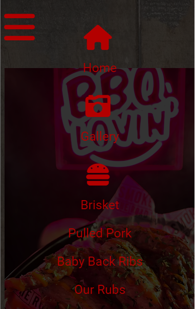
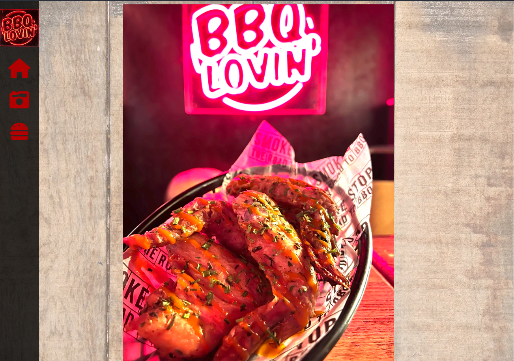
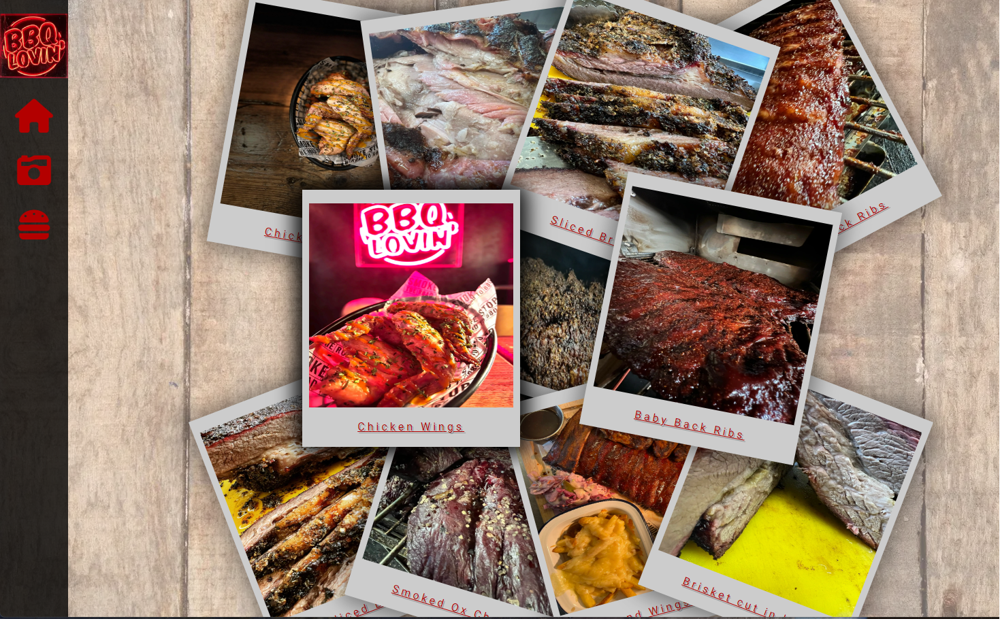

<body>
<h1 style="text-align: center;">BBQ Lovin</h1>

This is a website designed for people who would like to learn how to smoke meats and BBQ foods. It has been made to be responsive and accessible on a range of devices. The site will be useful for people who want to follow recipes and discover different smoking methods and uts of meat.

  

<h2 style="text-align: center;">Features</h2>
<h3>Existing Features</h3>
 

1. Navigation Bar
    
    - You will find the Navigation bar on all pages. It is responsive and intuitive. 
    
    - On desktop/laptop, you can hover over the black side bar which has the logo, home, gallery and a burger, to reveal the full navigation bar with links around the site.
    
    - On Mobile you will find the tradition 3 line "burger" icon. When clicked will reveal the mobile version of the navigation bar. You can also click the 3 bars to close the navigation, if you wanted to stay where you were.

    - The Navigation bar is designed so the users can easily navigate between pages, no matter what page they are on.

    - You can also easily tell which nav bar is which due to the lack of logo on mobile, this was due to space and found that with the logo on the nav bar, the writing was too small and/or too fidderly to click

         
 

2. Landing Page
    - The first image seen on the landing page is of chicken wings and our LED Logo sign.
    
    - Users will instantly see our logo, along with the chicken wings, giving them the idea they are in the right place for what they came for - BBQ Food.

    - the bright colors of the LED sign will grab there attention, along with the food presented infront of them.

        - 
         
3. The Gallery
    - Our Gallery will give the users lots of images to see what kind of food they can expect to be cooking using our recipes. 
    
    - It's important for the images to stand out to give the users that "food envy" effect and make them want to eat it. Giving them a polaroid effect and a stacked look, the users can clearly see all photos and make them salavate.

    - the mobile version of the gallery is a stacked single column. The "instagram scroll" effect. People spend there lifes scrolling down on sites and this is no different. Different pictures as they scroll will make them want try the food and therefore cook it.
        - 

  

<h2 style="text-align: center;">User Stories</h2>

- First time visitors will want to be able to understand the purpose of the site and be able to navigate through the recipes and information easily.

- returning visitors will want to find different recipes to try out and be able to contact the site to ask questions on problems they have had or for other recipes.

- frequent users will want to see new recipes added and keep up to date on any information or news added to the site reguarding BBQ.

 
 

<h2 style="text-align: center;">Design</h2>

- The colour scheme of the website will be black, red and white.

- The images used are of food what has been smoked and BBQ'd, to draw people in and have them wanting to do it themselves and entice the user into looking through the site more.

- The main font will be Roboto used throughout the whole website with sans serif as the fallback font. Roboto is a clean and easy reading font while also looking good.

 
 

<h2 style="text-align: center;"> Wireframes</h2>

- Below is a link in PDF to my wireframes for my website. This PDF also includes wireframes for mobile and desktop.

[Link to wireframe](/assets/PDFwireframeP1.pdf)

 
 

<h2 style="text-align: center;">Tech</h2>

- This website features interactive elements aswell as being fulling responsive on all devices.
- The Languages used to create this website is HTML5 and CSS3

</body>