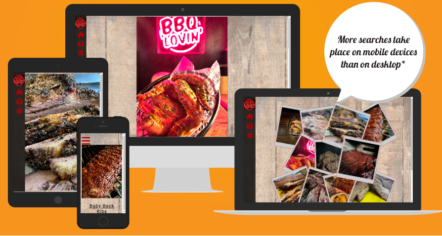

# BBQ Lovin

This is a website designed for people who would like to learn how to smoke meats and BBQ foods. It has been made to be responsive and accessible on a range of devices. The site will be useful for people who want to follow recipes and discover different smoking methods and uts of meat.

  

- - - 

## Contents

- [Initial Discussion](#initial-discussion)
    - [Key Information about the website](#key-information-about-the-website)
    - [User Stories](#user-stories)
- [Design](#design)
- [Wireframes](#wireframes)
- [Tech](#tech)
- [Features](#features)
    - [Existing Features](#existing-features)
        - [Navigation Bar](#1--navigation-bar)
        - [landing page](#2--landing-page)
        - [The Gallery](#3--the-gallery)
        - [Recipe Pages](#4--recipe-pages)
    - [Future Features](#future-features)
        - [Search Options](#1--search-options)
        - [News and Membership](#2--news-and-membership)
- [Validator Testing](#validator-testing)

- - - 

## Initial Discussion

BBQ Lovin is an online recipe website, focused around American BBQ smoked foods. Users can view the site from any device at any time and look at the recipes and information to learn to do the recipes.

### Key Information about the website

- Recipes for Smoking food and the rubs you need for them.
- Information on BBQs, Smokers and Woods to use.
- Pictures of food to intice users into using the recipes and methods to smoke food

## User Stories

- First time visitors will want to be able to understand the purpose of the site and be able to navigate through the recipes and information easily.

- returning visitors will want to find different recipes to try out and be able to contact the site to ask questions on problems they have had or for other recipes.

- frequent users will want to see new recipes added and keep up to date on any information or news added to the site reguarding BBQ.

- - - 

## Design

- The colour scheme of the website will be a rufous red #B30000 for text and icons, and black for headings and background navigation with an opcaity of 0.8.

- The images used are of food what has been smoked and BBQ'd, to draw people in and have them wanting to do it themselves and entice the user into looking through the site more.

    - Most photos where my own. Photos what 

- The main font will be Roboto used throughout the whole website with sans serif as the fallback font. Roboto is a clean and easy reading font while also looking good.

- - - 

## Wireframes

- Below is a link in PDF to my wireframes for my website. This PDF also includes wireframes for mobile and desktop.

[Link to wireframe](assets/readmeimages/PDFwireframeP1.pdf)

- - - 

## Tech

- This website features interactive elements aswell as being fulling responsive on all devices.
- The Languages used to create this website is HTML5 and CSS3

## Additional Programs Used

- Balsamiq used for creating wireframes.

- GitHub to save and store the files for our site.

- Google Fonts used to import the font used within the website.

- Font Awesome to use for icons on the website.

- Google Dev Tools was used to help test and troubleshoot any issues.

- Am I Responive used to show the website on a range of devices

- - - 

## Features
### Existing Features
 

1. #### Navigation Bar
    
    - You will find the Navigation bar on all pages. It is responsive and intuitive. 
    
    - On desktop/laptop, you can hover over the black side bar which has the logo, home, gallery and a burger, to reveal the full navigation bar with links around the site.
    
    - On Mobile you will find the tradition 3 line "burger" icon. When clicked will reveal the mobile version of the navigation bar. You can also click the 3 bars to close the navigation, if you wanted to stay where you were.

    - The Navigation bar is designed so the users can easily navigate between pages, no matter what page they are on.

    - You can also easily tell which nav bar is which due to the lack of logo on mobile, this was due to space and found that with the logo on the nav bar, the writing was too small and/or too fidderly to click

         
 

2. #### Landing Page
    - The first image seen on the landing page is of chicken wings and our LED Logo sign.
    
    - Users will instantly see our logo, along with the chicken wings, giving them the idea they are in the right place for what they came for - BBQ Food.

    - the bright colors of the LED sign will grab there attention, along with the food presented infront of them.

        - 
         
3. #### The Gallery
    - Our Gallery will give the users lots of images to see what kind of food they can expect to be cooking using our recipes. 
    
    - It's important for the images to stand out to give the users that "food envy" effect and make them want to eat it. Giving them a polaroid effect and a stacked look, the users can clearly see all photos and make them salavate.

    - the mobile version of the gallery is a stacked single column. The "instagram scroll" effect. People spend there lifes scrolling down on sites and this is no different. Different pictures as they scroll will make them want try the food and therefore cook it.
        - 
         
4. #### Recipe Pages
    - the recipes within the site are the main reason people will come to the website.
    
    - the pages are spread out in a way that it is easy to follow by just scrolling down, with photos between some of the steps to help the user know what to do.
     

### Future Features 

1. #### Search Options
    - Once the site has more recipes, I can implement a search bar using keywords to find recipes based on the users search word.

2. #### News and membership
    - Once the website has received a good amount of traffic and repeat users, i can implement a news section and a membership club
        - The News section can be viewable by all and include information like
            - new recipes
            - new BBQ/smoker options
            - Event updates from compitions
        - Membership club can include an email subscription, which can send emails when the news is updated. could also implement a hidden forum for bbq enthusiasts to come together and discuss there own recipes and troubleshoot any problems they have to other members.

- - - 

## Validator Testing

- all HTML Pages and CSS file has been through validator testing with zero problems back.

    - CSS 

    - [Index HTML](https://validator.w3.org/nu/?doc=https%3A%2F%2Fgorarth.github.io%2FBBQ-Lovin-project1%2Findex.html)

    - [Gallery HTML](https://validator.w3.org/nu/?doc=https%3A%2F%2Fgorarth.github.io%2FBBQ-Lovin-project1%2Fgallery.html)

    - [Brisket Recipe HTML](https://gorarth.github.io/BBQ-Lovin-project1/Recipes/brisket.html)

    - [Pulled Pork Recipe HTML](https://gorarth.github.io/BBQ-Lovin-project1/Recipes/pulledpork.html)

    - [Baby Back Ribs Recipe HTML](https://validator.w3.org/nu/?doc=https%3A%2F%2Fgorarth.github.io%2FBBQ-Lovin-project1%2FRecipes%2Fribs.html)

    - [Our Rubs Recipe HTML](https://validator.w3.org/nu/?doc=https%3A%2F%2Fgorarth.github.io%2FBBQ-Lovin-project1%2FRecipes%2Frubs.html    )
 

